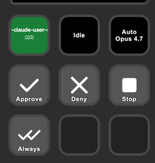

# agentsd

Stream Deck plugin for managing [Claude Code](https://claude.ai/code) sessions. Monitor session state, approve or deny permission requests, and control agents from hardware buttons.

<p align="center"></p>

## Requirements

- **macOS 13+** (Windows support tracked separately; see issue for details)
- **Stream Deck app 6.6+** plus a [Stream Deck](https://www.elgato.com/stream-deck) device
- **Node.js 20+**
- **Claude Code** with [HTTP hooks](https://code.claude.com/docs/en/hooks-guide) support

## How it works

Claude Code HTTP hooks post events to a local server (`127.0.0.1:9200`). The plugin translates those events into session state on Stream Deck buttons and dials.

```
Claude Code hooks → HTTP server (:9200) → SessionManager → Stream Deck UI
```

`PermissionRequest` hooks hold the HTTP response open (up to 120 s) so you can approve or deny directly from a button press.

## Install

```sh
git clone https://github.com/paultyng/agentsd.git && cd agentsd
npm install
npm install -g @elgato/cli   # one-time global; provides the `streamdeck` CLI used by `npm run link`/`dev`
npm run build
npm run link                 # register plugin with Stream Deck
npm run hooks:install        # add Claude Code HTTP hooks to ~/.claude/settings.json
```

After linking, restart the Stream Deck app. The actions appear under "Claude Code" in the action list.

### Uninstall

```sh
npm run hooks:uninstall      # remove hooks from ~/.claude/settings.json
npm run unlink               # unregister plugin
```

## Configuration

| Env var | Default | Effect |
|---|---|---|
| `AGENTSD_DEBUG` | unset | When `1`, the hook server exposes `GET /debug/sessions` returning a JSON snapshot of every tracked session. Used by the test suite; safe to enable locally for diagnostics. |

## Development

```sh
npm run watch        # rebuild on file changes
npm run dev          # Stream Deck dev mode (hot reload)
npm run debug:hooks  # interactive hook event probe
```

## Testing

`npm test` runs unit, integration, and end-to-end layers. E2E uses [testagent](https://github.com/paultyng/testagent), a deterministic fake of the Claude Code CLI (no model or API key); E2E tests skip when it's not on PATH. `npm run test:coverage` writes a report under `coverage/`. CI runs everything on Linux, macOS, and Windows.

## Actions

| Action | Type | Description |
|--------|------|-------------|
| **Session** | Button | Active session name, color-coded by state. Press to cycle sessions. Shows `(N/M)` counter. |
| **Session Dial** | Encoder | Rotate to cycle sessions. Same info as Session button in dial feedback. |
| **Status** | Button | Current state (`Working`, `Permission?`, `Question?`, `Idle`, `Error`), tool name, active work count (subagents + tasks). |
| **Mode** | Button | Permission mode (`Default`, `Plan`, `Auto`, etc.) and model name. |
| **Approve** | Button | Approve pending permission. Green when active, gray otherwise. |
| **Always Allow** | Button | Approve and add session-scoped allow rule for the tool. Gold when active, gray otherwise. |
| **Deny** | Button | Deny pending permission. Red when active, gray otherwise. |
| **Stop** | Button | Send Ctrl+C interrupt to frontmost Ghostty terminal. Red when a session is active. |
| **Focus** | Button | Bring Ghostty (or Claude Desktop) to foreground. |

## Session states

| State | Color | Meaning |
|-------|-------|---------|
| `IDLE` | Green | Session connected, waiting for input |
| `PROCESSING` | Blue | Tool execution in progress |
| `AWAITING_PERMISSION` | Gold | Permission prompt — approve or deny from Stream Deck |
| `AWAITING_ELICITATION` | Purple | Claude is asking a question |
| `DISCONNECTED` | Gray | No active session |

## Key behaviors

- **Auto-foreground**: Permission requests and elicitations automatically bring their session to the active slot.
- **Permission queue**: Multiple sessions can have pending permissions simultaneously. They're foregrounded in arrival order; resolving one auto-advances to the next.
- **Permission timeout**: 120s. Auto-denies if no response.
- **Stale pruning**: Idle or disconnected sessions with no activity for 60s are automatically removed.
- **Auto-create sessions**: If a hook event arrives for an unknown session (e.g., plugin restarted mid-session), the session is created as IDLE.
- **Model backfill**: If the hook payload doesn't include a model, it's extracted from the session transcript.

## Hook events

The plugin registers hooks for all Claude Code lifecycle events:

`SessionStart`, `SessionEnd`, `UserPromptSubmit`, `PreToolUse`, `PostToolUse`, `PostToolUseFailure`, `Stop`, `StopFailure`, `PermissionRequest`, `Notification`, `SubagentStart`, `SubagentStop`, `TaskCreated`, `TaskCompleted`, `Elicitation`, `ElicitationResult`

Each event is posted to `http://localhost:9200/hooks/{EventName}`. The `hooks:install` script manages registration in `~/.claude/settings.json`.

## Acknowledgments

Inspired in part by [AgentDeck](https://github.com/puritysb/AgentDeck).
